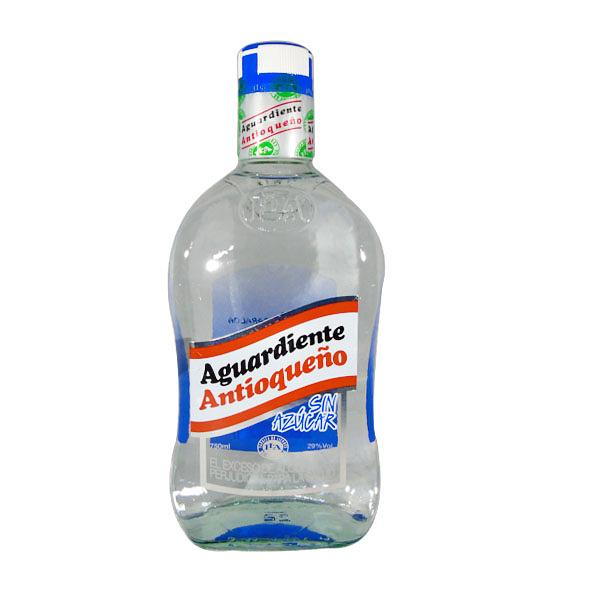
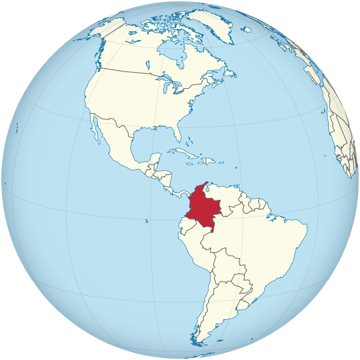

```{r setup, include=FALSE}
knitr::opts_chunk$set(echo = TRUE, message = FALSE,
                      warning = FALSE)
```

<center>
{width="300"}
{width="200"}

</center>

# Introduction

The aim of this project is to build a machine learning model that accurately predicts whether or not a teenager in Colombia has tried alcohol in the past. For this project, I will use data from the largest longitudinal survey in Colombia and I will implement different models and techniques to provide the most accurate model for this classification model given that the outcome variable is binary.

**Loading Packages and Setting Up The Environment**

```{r}

# For the models
library(tidyverse)
library(tidymodels)
library(discrim)
library(rpart.plot)
library(ranger)
library(vip)
library(xgboost)
library(randomForest) 

# For plots, graphs and EDA

library(ggplot2)
library(ggpubr)
library(corrplot)
library(corrr)
library('fastDummies')

# Data cleaning

library(janitor)
library(dplyr)
```

## Where is Colombia and what are the alcohol consumption patterns?

Colombia is located in the north of South America (as seen in the map below). It is a country with a well-known history of internal armed conflict and is the only country in South America with access to both oceans (Pacific and Atlantic). Society widely accepts alcohol consumption and the social norms around it are such that young kids start drinking alcoholic beverages at an early age. Sometimes this consumption is promoted in the household by the parents of the children or in the neighborhood or school by friends. According to the official statistics in 2019, 84% of people 12-65 reported having tried alcohol. The same report found that for people officially enrolled in the educational system, 70.4% of the female students and 68.1% of the male students reported having tried alcohol, indicating how alcohol consumption among teenagers is widely accepted in the country. Even more, there is evidence that, on average, kids tend to try alcohol for the first time at 13 years of age.


<center>
{width="300"}
</center>

## Why is this model relevant?

Alcohol consumption is related to risky behaviors and crime in Colombia. For example, interpersonal violence is more common when people are under the influence of alcohol. Also, driving under the influence remains a problem in some areas of the country, especially the rural areas. Finally, according to the Ministry of Health and Social Protection, 28.35% of the people who committed suicide in the country had alcohol addiction problems. From the public policy perspective, it would be essential to analyze teenagers' risk factors for them to properly develop the correct public policies and programs to prevent the negative consequences of alcohol consumption. The Ministry of Health and Social Protection has prevention programs, but they cannot fully target the correct population subgroup. I want to create a model that can accurately predict the likelihood of trying alcohol. Still, it also can provide the risk factors that the government should consider when designing the programs. By doing so, I hope to improve the statistical capacity of the Ministry and provide them with helpful tools that can improve public policy regarding such an important topic for the country and the lives of Colombian teenagers.

## Project Roadmap and Data

As I explained previously, given Colombia's social norms and the question's relevance, I will implement Machine Learning tools to build a model that allows us to predict alcohol consumption among teenagers. The goal of the model will be to predict a binary variable that represents whether a teenager has tried alcohol or not. For this, I will go through 5 different tasks. First, I will clean the data to ensure the variables and information are ready to use. Second, I will perform some exploratory data analysis to provide insights about the data, the variables, and the relationship among them. Third, I will split the data into training and test set and follow the usual steps (recipe, workflow, folds, etc.) to implement the following models: logistic regression, LDA, QDA, Elastic Net, Decision Tree, Random Forest, and Boosted Tree in the training set. Fourth, I will evaluate the performance of the models to choose the best one. Fifth, I will fit the selected model in step 4 on the testing set to assess its performance.

For this project, I am using the largest longitudinal survey in Colombia. The survey includes three waves from 2010, 2013, and 2016. It has questions about the households' characteristics, children's outcomes, and parents' outcomes in every single wave. The data is publicly available to download from https://encuestalongitudinal.uniandes.edu.co/es/. However, I will be using some restricted-use information in this project. 

Let's start by opening the data:

```{r class.source = 'fold-show'}
# Open ELCA data
ELCA <- read_csv("Data/ELCA_data.csv")

# Getting the dimensions of our data 
dim(ELCA) 
```

As we can observe, for this project, I will use the information for 4211 teeangers in Colombia that are representative of both urban and rural areas of the country.The data set includes 256 different variables that could potentially be used as predictors but I will only use those that are in theory more likely to be related to alcohol consumption.

# Data Cleaning

Given that I am using survey data, it is important to make sure everything is ready to be used and that the data is coded appropriately. For example, I need to make sure that all the factor variables are properly set, that missing values are treated properly, and that the binary variables are set correctly. In this section, I will make all the necessary data cleaning before we can actually start using the data.

First, we will need to clean the names and select the predictors that we think will be useful in the analysis. I selected the predictors based on my knowledge as a Health Economist and my experience working with alcohol consumption patterns and data in Colombia.

```{r}
# Clean the names
ELCA <- ELCA %>% 
  clean_names()

# Select necessary variables and show them
ELCA <- ELCA %>% 
  select(ha_bebido, edad, sexo, educ, edad_padres, educ_padres, biparental_2010, ln_t_anual_2010,
         t_personas_2010, zona_2010, probado_cigarro, pertenece_pandilla)

ELCA %>%
  head()
```

Now we can factor all the categorical/dummy variables as needed and to create the `income` variable in levels. Also, we need to make sure we drop the teenagers who refuse to answer the risky behaviors questions:

```{r}
# Factor all the necessary variables
ELCA_clean <- ELCA %>% 
  mutate(ha_bebido = factor(ha_bebido), probado_cigarro = factor(probado_cigarro), pertenece_pandilla = factor(pertenece_pandilla), sexo = factor(sexo), biparental_2010 = factor(biparental_2010), zona_2010 = factor(zona_2010)) %>%
  mutate(t_anual_2010 = exp(ln_t_anual_2010))

# Find missing values in the three main variables about risky behaviors
missing_alcohol <- ggplot(ELCA_clean) + geom_bar(aes(x = ha_bebido), colour = 'navyblue', fill = 'navyblue') + labs(title = "Tried Alcohol", y = '# of teenagers', x = '')

missing_smoking <- ggplot(ELCA_clean) + geom_bar(aes(x = probado_cigarro), colour = 'navyblue', fill = 'navyblue') + labs(title = "Tried smoking", y = '# of teenagers', x = '')

missing_gangs <- ggplot(ELCA_clean) + geom_bar(aes(x = pertenece_pandilla), colour = 'navyblue', fill = 'navyblue') + labs(title = "Member of a gang", y = '# of teenagers', x = '')

figure_missing <- ggarrange(missing_alcohol, missing_smoking, missing_gangs,
                            ncol = 3, nrow = 1)
figure_missing
```

Therefore, we will filter the data set to include only the teenagers that answer all three of the questions as follows:

```{r}
# Keep the observation that meet the needed requirements
ELCA_clean <- ELCA_clean %>% 
  filter(ha_bebido %in% c('Yes', 'No')) %>% 
  filter(probado_cigarro %in% c('Yes', 'No')) %>% 
  filter(pertenece_pandilla %in% c('Yes', 'No'))

# I also need to drop some observations because parents' information is not easy to impute.
ELCA_clean <- ELCA_clean %>% 
  drop_na(c("edad_padres", "educ_padres", "ln_t_anual_2010"))

# Getting the dimensions of our final data 
dim(ELCA_clean) 

ELCA %>%
  head()
```

Therefore, we have information for 4010 teenagers and for 13 variables. There is one variable for which there are not complete values (`educ`). I will try to impute the values of it in my models later using `edad`. The data looks exactly how it should look like and it includes enough information for the model to learn effectively using the Machine Learning tools.

The final list of variables to be use is the following:

* Response variable:
  + `ha_bebido`: Gives 1 if the teenager has tried alcohol, 0 otherwise

* Predictors:
  + `edad`: Age of the teenager
  + `sexo`: Gives 1 if the teenager is male, 0 otherwise
  + `educ`: Years of education of the teenager
  + `edad_padres`: Age of the parents (mother in most cases)
  + `educ_padres`: Years of education of the parents (mother in most cases)
  + `biparental_2010`: Gives 1 if the household includes both parents, 0 otherwise
  + `ln_t_anual_2010`: Logarithm of the total annual income. I use logarithm for this variable following the economic literature in which we are interested in the changes in income and not in the levels. This is the one I will use in the models.
  + `t_personas_2010`: Household size
  + `zona_2010`: Gives 1 if the household lives in urban area, 0 otherwise (rural)
  + `probado_cigarro`: Gives 1 if the teenager has tried smoking, 0 otherwise
  + `pertenece_pandilla`: Gives 1 if the teenager belongs to a gang, 0 otherwise
  + `t_anual_2010`: Total annual income in levels (colombian pesos). I created this one for the EDA as it is easier to understand and more intuitive.
  
# Exploratory Data Analysis

It is important for us to understand the information included in the dataset and the relationship among the variables before trying to implement any of the models. In this section, I will analyze some of the key variables using visualizations and other functions. Now that the data is ready we can use `ggplot`, `corrplot`, among others to present the visual EDA.

## Summary Statistics

Let's start by taking an overall look to the variables to get some information about the means, standard deviations and missing values.

```{r}
# Add the numeric version of the variables for the correlations and later analysis
ELCA_clean$ha_bebido_dummy <- ifelse(ELCA_clean$ha_bebido == 'Yes', 1, 0)
ELCA_clean$probado_cigarro_dummy <- ifelse(ELCA_clean$probado_cigarro == 'Yes', 1, 0)
ELCA_clean$pertenece_pandilla_dummy <- ifelse(ELCA_clean$pertenece_pandilla == 'Yes', 1, 0)
ELCA_clean$sexo_dummy <- ifelse(ELCA_clean$sexo == 'Male', 1, 0)
ELCA_clean$zona_2010_dummy <- ifelse(ELCA_clean$zona_2010 == 'Urbano', 1, 0)
ELCA_clean$biparental_2010_dummy <- ifelse(ELCA_clean$biparental_2010 == '1', 1, 0)

# Generate a numeric dataset with the variables excluding age of first drink
ELCA_numer <- ELCA_clean %>%
  select_if(is.numeric) 

# Create the summary table
ELCA_numer %>% summary()
```

The results show the following:

**Response variable:**

+ 40.3% of the teenagers reported having tried alcohol

**Predictors:**

+ The teenagers in the sample are 9-16 years old and on average they are 12.47 years old.
+ The sample includes teenagers between 0 and 11 years of education with 5.72 being the average. This is consistent with the national statistics and reflects most of them have at least completed primary school. There are 17 teenagers for which we don't have education information and we will need to impute it.
+ The survey includes parents between 16 and 82 years old. This variable also reflects the caregivers' information which is why we have that young parents. On average, the parents are 40.49 years old.
+ In terms of education parents have between 0 and 21 years of education. On average, they have 7.16 years of education which is also consistent with national statistics. 
+ Regarding income, we have information about the natural logarithm and we can't really interpret it beyond knowing that those with higher log means that they are richer. As I explained above, in economics we are not interested in the levels, rather in the changes.
+ Also related to income, we have information about the levels. On average, the households earn COP$11.280.006 (USD$2.350 using the current exchange rate).
+ As expected, some of the households in the survey are quite big. Household size ranges from 2 to 28 people. The average household has 5.7 members.
+ 4% of the teenagers reported having tried a cigarette.
+ Less than 1% of the teenagers reported being a member of a gang.
+ 49.78% of the teenagers are male.
+ 44.69% of the teenagers live in urban areas
+ 66.83% of the teenagers reported living in a two-parent household

## Correlation Plot

```{r}
# Calculate correlations for the observations with complete information not including bebe_joven
correlations_1 <- cor(ELCA_numer, use = "complete.obs")  

# Correlation matrix 
corrplot(correlations_1, order = 'alphabet', col = COL2("PuOr"))
```

It seems most of the predictors are not correlated with the outcomes or show a little correlation. However `edad`, `educ` and `probado_cigarro` show a positive correlation with whether the teenager has tried alcohol (`ha_bebido`). This is quite obvious ase older kids should be more likely to have tried alcohol, and kids with higher education also tend to be older which is why it also makes sense to see a positive correlation. Regarding smoking, the literature in health economics has found that risky health behaviors are complements normally and those who engage in one tend to engage in others. It seems none of the other variables related to parents' information and the household's characteristics are not correlated with `ha_bebido`. Note that in this correlation plot `bebe_joven` is not in it because I restric to the observations who have non missings for every varible and including `bebe_joven` would restrict the sample to those who actually have tried alcohol and I wouldn't be able to produce the correlations with the other predictors.

## Characteristics of teenagers that drink

Now we would like to understand more about the characteristics of the teenagers that drink. This section plots the response variable with some of the predictors to understand any pattern that might arise.

### By Gender

```{r}
bebido_gender <- ggplot(ELCA_clean, aes(x = ha_bebido,  group = sexo)) + 
    geom_bar(aes(y = ..prop.., fill = factor(..x..)), stat = "count", show.legend = FALSE) +
    geom_text(aes(label = scales::percent(..prop..), y = ..prop.. ), stat= "count", vjust = -.5) +
    labs(title = "Tried alcohol", y = "Percent", x = "") +
    facet_grid(~sexo) +
    scale_y_continuous(labels = scales::percent) +
  scale_fill_manual(values = c("navyblue", "#FB4F14"))

bebido_gender
```

The figure above shows that Male are more likely to have tried alcohol. This results are consistent with what we know about alcohol consumption in Colombia which is that men tend to start drinking at a early age and the consumption by men is encourage even by the family and the peers. However, the difference between male and female is not that big (41.7% vs 38.9%).

### By Zone

```{r}
bebido_zona <- ggplot(ELCA_clean, aes(x = ha_bebido,  group = zona_2010)) + 
    geom_bar(aes(y = ..prop.., fill = factor(..x..)), stat = "count", show.legend = FALSE) +
    geom_text(aes(label = scales::percent(..prop..), y = ..prop.. ), stat= "count", vjust = -.5) +
    labs(title = "Tried alcohol", y = "Percent", x = "") +
    facet_grid(~zona_2010) +
    scale_y_continuous(labels = scales::percent) +
  scale_fill_manual(values = c("navyblue", "#FB4F14"))

bebido_zona
```

The figure above shows that teenagers living in urban areas are more likely to have tried alcohol. This is potentially related to alcohol being more available in urban areas and easier access which allows the teenagers to drink it more easily. However, just as in the previous graph, the difference between urban and rural is not that big (41.6% vs 39.2%). This result is quite surprising to me being Colombian but it might reflect a generational change in the alcohol patterns of the younger generations.

### By Other Risky Behaviors

```{r}
bebido_smoking <- ggplot(ELCA_clean, aes(x = ha_bebido,  group = probado_cigarro)) + 
    geom_bar(aes(y = ..prop.., fill = factor(..x..)), stat = "count", show.legend = FALSE) +
    geom_text(aes(label = scales::percent(..prop..), y = ..prop.. ), stat= "count", vjust = -.5) +
    labs(title = "Tried alcohol by smoking behavior", y = "Percent", x = "") +
    facet_grid(~probado_cigarro) +
    scale_y_continuous(labels = scales::percent) +
  scale_fill_manual(values = c("navyblue", "#FB4F14"))

bebido_gang <- ggplot(ELCA_clean, aes(x = ha_bebido,  group = pertenece_pandilla)) + 
    geom_bar(aes(y = ..prop.., fill = factor(..x..)), stat = "count", show.legend = FALSE) +
    geom_text(aes(label = scales::percent(..prop..), y = ..prop.. ), stat= "count", vjust = -.5) +
    labs(title = "Tried alcohol by gang membership", y = "Percent", x = "") +
    facet_grid(~pertenece_pandilla) +
    scale_y_continuous(labels = scales::percent) +
  scale_fill_manual(values = c("navyblue", "#FB4F14"))

figure_risky <- ggarrange(bebido_smoking, bebido_gang,
                            ncol = 2, nrow = 1)
figure_risky
```

The figures above show that as expected the adoption of certain risky behaviors such as smoking or joing a gang is related to adopting another risky behavior (drinking). In particular, smoking is very related to drinking as 92% of the teenagers who have smoked, have also tried alcohol. Regarding gang membership, the relationship is not as strong but still 58.3% of the teenagers that belong to a gang, also have tried alcohol. These results highlight the importance of including predictors related to other risky behaviors adoption in our model as they are correlated with the response variable. 

### By Age, Years of education and Order of the child

```{r}
bebido_edad <- ggplot(ELCA_clean) + 
  geom_bar(aes(x = edad, fill = ha_bebido), position = "fill") + 
  labs(title = "Tried alcohol", y = "Percent", x = "Age", fill = "") +
  scale_y_continuous(labels = scales::percent) +
  scale_fill_manual(values = c("navyblue", "#FB4F14"))

bebido_educ <- ggplot(ELCA_clean) + 
  geom_bar(aes(x = educ, fill = ha_bebido), position = "fill") + 
  labs(title = "Tried alcohol", y = "Percent", x = "Years of education", fill = "") +
  scale_y_continuous(labels = scales::percent) +
  scale_fill_manual(values = c("navyblue", "#FB4F14"))

figure_cont <- ggarrange(bebido_edad, bebido_educ,
                            ncol = 2, nrow = 1)
figure_cont
```

The figures above show some interesting and not surprising results. The panel in the left shows the proportion of teenagers that drink by age and as expected this proportion increases as the kids grows older. The right panel shows the same but for years of education. It seems that for the first 5 years of education there is no a clear pattern but after that it starts increasing as expected in a similar way like age.

### Distribution of Age by zone

It is also interesting to understand the relationship among some of my predictors. In particular, it is interesting to check the relationship between age and zone to figure out if the age of the children in the two areas is balanced or not.

```{r}
ggplot(ELCA_clean) + geom_bar(aes(x = edad), colour = 'navyblue', fill = 'navyblue') + labs(title = "Age", y = '# of teenagers', x = 'Age')

ggplot(ELCA_clean) + geom_boxplot(aes(y = zona_2010, x = edad), colour = 'navyblue', fill = '#FB4F14') + labs(title = "Age of first drink", y = '', x = 'Age') + coord_flip()
```

The bar plot shows that the teenagers are between 9 and 16 years old. The distribution shows that the survey was not properly able to survey teenagers that were 9 and 16 years old as the proportion of them in that age is considerably smaller. The number of teenagers ages 10 to 15 is pretty much the same. This plot suggest that it might be necessary to stratified the sampling by age to guarantee there are teenagers of every age in the samples.

When looking more carefully into the zone of the country in which they live (urban vs rural), we can observe in the box plot that, that he median kid in both areas is 13 years old. Even more, the 25th and 75th percentile of the age distribution is also the same for both areas. These are amazing news as we know that the age distribution between the two areas of the country is pretty much the same.

## Characteristics of parents and households of the teenagers that drink

Now we would like to understand more about the characteristics of the parents of the teenagers that drink. This section plots the response variable with some of the predictors related to the parents to understand any pattern that might arise.

### By Age and Years of education of the parents

```{r}
bebido_edad_par <- ggplot(ELCA_clean) + 
  geom_bar(aes(x = edad_padres, fill = ha_bebido), position = "fill") + 
  labs(title = "Tried alcohol", y = "Percent", x = "Parents' Age", fill = "") +
  scale_y_continuous(labels = scales::percent) +
  scale_fill_manual(values = c("navyblue", "#FB4F14"))

bebido_educ_par <- ggplot(ELCA_clean) + 
  geom_bar(aes(x = educ_padres, fill = ha_bebido), position = "fill") + 
  labs(title = "Tried alcohol", y = "Percent", x = "Parents' Years of education", fill = "") +
  scale_y_continuous(labels = scales::percent) +
  scale_fill_manual(values = c("navyblue", "#FB4F14"))

figure_cont_par <- ggarrange(bebido_edad_par, bebido_educ_par,
                            ncol = 1, nrow = 2)
figure_cont_par
```

The figures above also show some interesting and not surprising results. The results are actually very similar to the ones found using the teenagers' characteristics. The panel in the left shows the proportion of teenagers that drink by age of the parents. It seems that the proportion of kids that have tried alcohol increases with age of the parents up to around 50 years old. After that, it is relatively flat but also very noisy. This possibly reflects a monetary contraint and we will take a look into that later. 

The panel in the right shows the proportion but using the years of education of the parents. The plot shows a rather flat proportion, and there is no clear pattern regarding the way the parents' education should impact the alcohol consumption decisions.

### By Household Income

```{r}
# Overall means
incomedata <- ELCA_clean %>%
  group_by(ha_bebido) %>%
  summarize(mean_income = mean(t_anual_2010))

ggplot(incomedata, aes(x = ha_bebido, y = mean_income)) +
  geom_bar(stat = "identity", fill = "navyblue") +
  geom_text(aes(label = dollar(mean_income)), vjust = -0.25) +
  scale_y_continuous(breaks = seq(0, 12000000, 2000000), label = dollar) +
  labs(title = "Mean Income by Alcohol decision", x = "", y = "")

# Means by Zone
incomedata_urban <- ELCA_clean %>%
  filter(zona_2010 %in% c('Urbano')) %>% 
  group_by(ha_bebido) %>%
  summarize(mean_income = mean(t_anual_2010)) %>% 
  subset(!is.na(mean_income)) %>%
  mutate(ha_bebido = replace_na(ha_bebido, "No"))

income_urban <- ggplot(incomedata_urban, aes(x = ha_bebido, y = mean_income)) +
  geom_bar(stat = "identity", fill = "navyblue") +
  geom_text(aes(label = dollar(mean_income)), vjust = -0.25) +
  scale_y_continuous(breaks = seq(0, 18000000, 2000000), label = dollar) +
  labs(title = "Mean Income by alcohol decision", subtitle = "Urban areas", x = "", y = "")


incomedata_rural <- ELCA_clean %>%
  filter(zona_2010 %in% c('Rural')) %>% 
  group_by(ha_bebido) %>%
  summarize(mean_income = mean(t_anual_2010))

income_rural <- ggplot(incomedata_rural, aes(x = ha_bebido, y = mean_income)) +
  geom_bar(stat = "identity", fill = "navyblue") +
  geom_text(aes(label = dollar(mean_income)), vjust = -0.25) +
  scale_y_continuous(breaks = seq(0, 10000000, 2000000), label = dollar) +
  labs(title = "Mean Income by alcohol decision", subtitle = "Rural areas", x = "", y = "")

figure_income <- ggarrange(income_urban, income_rural,
                            ncol = 2, nrow = 1)
figure_income
```
The first figure above shows that, on average, the children that have tried alcohol live in slightly richer households (COP$360.00 higher or USD$75.14) which is expected given that alcohol is expensive and the teenagers need to have access to resources in order to get it. The second plot divides the sample by zone to understand the differences across areas of the country. The first thing to note in that graph is that rural areas are clearly poorer than urban ones. This result is not surprising as a Colombian because most of the economic activity and big industries are located in the four biggest cities of the country which are very urban. While rural areas are not very well developed and the economy is not as strong, leading to poorer households and lower wages. Second, the graph shows that the rural areas are the ones driving the difference in income as those who have tried alcohol live in richer households and the difference is bigger than the overall one. This might be related to rural households having more salient resource constraints while in urban areas the effect of the income is almost meaningless. 

### By Two-parent Household and Household size

```{r}
# Labels for facet_grid
biparental.labs <- c("No", "Yes")
names(biparental.labs) <- c("0", "1")

# Graph
bebido_biparental <- ggplot(ELCA_clean, aes(x = ha_bebido,  group = biparental_2010)) + 
    geom_bar(aes(y = ..prop.., fill = factor(..x..)), stat = "count", show.legend = FALSE) +
    geom_text(aes(label = scales::percent(..prop..), y = ..prop.. ), stat= "count", vjust = -.5) +
    labs(title = "Tried alcohol by two-parent household", y = "Percent", x = "") +
    facet_grid(~biparental_2010, labeller = labeller(biparental_2010 = biparental.labs)) +
    scale_y_continuous(labels = scales::percent) +
  scale_fill_manual(values = c("navyblue", "#FB4F14"))

bebido_hhsize <- ggplot(ELCA_clean) + 
  geom_bar(aes(x = t_personas_2010, fill = ha_bebido), position = "fill") + 
  labs(title = "Tried alcohol", y = "Percent", x = "Household size", fill = "") +
  scale_y_continuous(labels = scales::percent) +
  scale_fill_manual(values = c("navyblue", "#FB4F14"))

figure_hh <- ggarrange(bebido_biparental, bebido_hhsize,
                            ncol = 1, nrow = 2)
figure_hh
```

The figure in the top panel shows the relationship between having tried alcohold and living in a two-parent household. The results indicate that teenagers that live with both of their parents are less likely to drink which is consistent with the psychology evidence and the economics literature. Alcohol tends to be used as a coping mechanism when there are stressful situations such like parent separation, death of a parent, etc. The panel below plots the relationship with household size and shows that there is no clear correlation between it and alcohol decisions.

# Models

## Setting Up Models

Now that we did some EDA about the data and the relationships between the predictors and the response variable, we are ready to start setting the models. For this we will follow the usual steps:

+ Train/test split
+ Create our recipes
+ Cross-validation 

### Train/Test Split

The first step is to perform a training/testing split in the data so we can properly train and test our models. I decided to do a 80/20 split for this data so I can allow for enough observations in the testing data, but I also need to have enough observations to train the model and for it to learn. As usual I need to set a seed to I can ensure that the split is the same every single time I run the code and that it won't affect the results. Finally, I will stratify the sampling using the response variable `ha_bebido`

```{r}
# Initial split
set.seed(3435)
ELCA_split <- initial_split(ELCA_clean, prop = 0.80,
                               strata = ha_bebido)
ELCA_train <- training(ELCA_split)
ELCA_test <- testing(ELCA_split)

dim(ELCA_train)
dim(ELCA_test)
```

There are now 3207 observations in the training data set, and 803 observations in the testing data set. These numbers are more than enough observations for each of the samples and would allow us to build the models properly.

### Building the recipe

Now we can set the recipe that will be used in our models later. As we have explained before, the response variable is `ha_bebido` and there is information on 13 predictors that will be used in it. The recipe will be used to properly treat the information of the children regarding their characteristics, those of their parents and households. As in the class, the recipe will be the same but the way each model works with it will be different and that will allow us to compare the results to find the model that produces a better fit. Regarding the variables to be used there are two things to note: i) children education will be impute linearly using the age for those who are missing education information, and ii) the order of the children will be dummy encode given that it is a categorical predictor. All the predictors will be center and scale and I will have an interaction of the income and zone based on the EDA results discussed previously.

```{r}
# Recipe building for the models
ELCA_recipe <-   
  recipe(ha_bebido ~ edad + sexo_dummy + educ  + edad_padres + educ_padres +
           biparental_2010_dummy + ln_t_anual_2010 + t_personas_2010 + zona_2010_dummy +
           probado_cigarro_dummy + pertenece_pandilla_dummy, 
         data = ELCA_train) %>% # Model with the predictors required in the training data
  step_impute_linear(educ, impute_with = imp_vars(edad)) %>% # Impute education with age
  step_normalize(all_predictors()) %>%  # Center and scale all predictors
  step_interact(~ zona_2010_dummy:ln_t_anual_2010) # Interaction between `age` and `fare` 
```

### K-Fold Cross Validation

Finally, we will need to use stratified (by `ha_bebido`) cross validation. For this, we need to create the folds that will be used in the *v*-fold cross-validation on the training set.

```{r}
# Use *v*-fold cross-validation on the training set with 5 folds
ELCA_folds <- vfold_cv(ELCA_train, strata = ha_bebido, v = 10)
ELCA_folds

# For later use in the fit_resamples
control <- control_resamples(save_pred = TRUE) 
```


## Running the models

All this work but we have finally reached the moment we have all been waiting. Let's run the models! For this project, we will run seven different machine learning models using the same recipe so we can compare the results and evaluate their performance. Given that the response variable is a binary one, we will use the `roc_auc` as the metric of performance given the efficiency in a classification problem like the one we have. Just as in the previous section, we will need to follow some steps for each model:

+ Set up the model (type, engine, mode)
+ Create a workflow that includes the model and the recipe
+ Fit that model to the training data using the folds
+ Save the results so we don't have to run them every single time

Additionally, for Elastic Net, Decision Tree, Random Forest and Boosted Tree we need to add some extra steps before fitting the model to the training data as follows:

+ Create a regular grid for the hyperparameters that we will tune and set the appropriate number of levels (10 for us)
+ Tune the hyperparameters of the model (one or more depeding on the model)
+ Choose the model with the best performance (i.e. the hyperparameters with the best performance out of all the tuning)
+ Finalize the workflow with the hyperameters from the selected model

Now that we know the roadmap and the steps that we need to follow, we are ready to start. For each model I will save the results such that I don't have to run the code again. Also, I will use the `roc_auc` as the metric to evaluate the performance.

### Logistic Regression

The first model is a logistic regression estimated in the usual way using the recipe and resampling the data using the folds as we did in Homework 4. Given that I have 10 folds, it means I am estimating each model 10 times. 

```{r class.source = 'fold-show'}
# Specify logistic regression
log_reg <- logistic_reg() %>% 
  set_engine("glm") %>% 
  set_mode("classification")

# Create a workflow
log_wkflow <- workflow() %>% 
  add_model(log_reg) %>% 
  add_recipe(ELCA_recipe)

# Apply workflow to training data
log_fit <- fit_resamples(log_wkflow, resamples = ELCA_folds, metrics = metric_set(roc_auc))

# Save results
save(log_fit, log_wkflow, file = "Results/Logistic.rda")
```

We will analyze the results and check the performance of the model in the next section so we can compare across all the models.`

### LDA

The second model is a linear discriminant analysis (LDA) in the usual way using the recipe and resampling the data using the folds as we did in Homework 4. Given that I have 10 folds, it means I am estimating each model 10 times.

```{r class.source = 'fold-show'}
# Specify linear discriminant analysis model
lda_mod <- discrim_linear() %>% 
  set_mode("classification") %>% 
  set_engine("MASS")

# Create a workflow for lda
lda_wkflow <- workflow() %>% 
  add_model(lda_mod) %>% 
  add_recipe(ELCA_recipe)

# Apply workflow to training data
lda_fit <- fit_resamples(lda_wkflow, resamples = ELCA_folds, control = control,
                         metrics = metric_set(roc_auc))

# Save results
save(lda_fit, lda_wkflow, file = "Results/LDA.rda")
```

We will analyze the results and check the performance of the model in the next section so we can compare across all the models.

### QDA

The third model is a quadratic discriminant analysis (QDA) in the usual way using the recipe and resampling the data using the folds as we did in Homework 4. Given that I have 10 folds, it means I am estimating each model 10 times. 

```{r class.source = 'fold-show'}
# Specify quadratic discriminant analysis model
qda_mod <- discrim_quad() %>% 
  set_mode("classification") %>% 
  set_engine("MASS")

# Create a workflow
qda_wkflow <- workflow() %>% 
  add_model(qda_mod) %>% 
  add_recipe(ELCA_recipe)

# Apply workflow to training data
qda_fit <- fit_resamples(qda_wkflow, resamples = ELCA_folds, control = control, 
                         metrics = metric_set(roc_auc))

# Save results
save(lda_fit, lda_wkflow, file = "Results/QDA.rda")
```

We will analyze the results and check the performance of the model in the next section so we can compare across all the models.

### Elastic Net

The fourth model is an elastic net in which we tune `penalty` and `mixture` in the usual way using the recipe and resampling the data using the folds as we did in Homework 5. Given that I have 10 folds, it means I am estimating each model 10 times. However, I also have 10 levels for each of the hyperparameters which means I have 100 different possible combinations of models and each of them has to run 10 times. Therefore, I will run 1000 models. 

```{r class.source = 'fold-show'}
# Specify elastic net model
elastic_net <- multinom_reg(penalty = tune(), mixture = tune()) %>% # Tune `penalty` and `mixture`
  set_mode("classification") %>% 
  set_engine("glmnet") # Use `multinom_reg` with the `glmnet` engine

# Create a workflow for the model
elastic_wkflow <- workflow() %>% 
  add_model(elastic_net) %>% 
  add_recipe(ELCA_recipe)

# Set grid with values of `mixture` and `penalty`, and levels
elastic_grid <- grid_regular(penalty(range = c(-5, 5)), mixture(range = c(0, 1)), levels = 10)

# Fit models to folded data using `tune_grid()`
tune_elastic <- tune_grid(elastic_wkflow,
                          resamples = ELCA_folds, 
                          grid = elastic_grid,
                          metrics = metric_set(roc_auc))

# Save results
save(tune_elastic, elastic_wkflow, file = "Results/Elastic.rda")
```

Now we need to choose the best model and finalize the workflow with those hyperparameters. We will also check the autoplots to understand how the tuning affects the results.

```{r}
# Load data saved
load("Results/Elastic.rda")

# Use `autoplot()` on the results
autoplot(tune_elastic)

# Select best model
best_model <- select_best(tune_elastic, metric = "roc_auc")
best_model

# Fit the selected model
elastic_final <- finalize_workflow(elastic_wkflow, best_model)
elastic_final_fit <- fit(elastic_final, data = ELCA_train)
```

The plots show that having a low `mixture` (represented by the Proportion of Lasso Penalty) and `penalty` (represented by the Amount of regularization) yield higher ROC-AUC and accuracy levels when they are smaller. This implies that low values of `mixture` and `penalty`produce higher accuracy levels and improve the ROC-AUC. Indeed, the best model is the one with `mixture = 0`  and  `penalty = 0.2782559`. We will analyze the results and check the performance of the model in the next section so we can compare across all the models.

### Decision Tree

The fifth model is a decision tree in which we tune `cost_complexity` in the usual way using the recipe and resampling the data using the folds as we did in Homework 6. Given that I have 10 folds, it means I am estimating each model 10 times. However, I also have 10 levels for the hyperparameter. Therefore, I will run 100 models.

```{r}
# Specify decision tree model
tree_spec <- decision_tree() %>%
  set_engine("rpart")
class_tree_spec <- tree_spec %>%
  set_mode("classification")

# Create a workflow for the model
class_tree_wf <- workflow() %>% 
  add_model(class_tree_spec %>% set_args(cost_complexity = tune())) %>% 
  add_recipe(ELCA_recipe)

# Set grid with values of `cost_complexity`, and levels
param_grid <- grid_regular(cost_complexity(range = c(-3, -1)), levels = 10)

# Fit models to folded data using `tune_grid()`
tune_res <- tune_grid(
  class_tree_wf, 
  resamples = ELCA_folds, 
  grid = param_grid, 
  metrics = metric_set(roc_auc)
)

# Save results
save(tune_res, class_tree_wf, file = "Results/Tree.rda")
```

Now we need to choose the best model and finalize the workflow with the hyperparameter. We will also check the autoplots to understand how the tuning affects the results.

```{r}
# Load data saved
load("Results/Tree.rda")

# Use `autoplot()` on the results
autoplot(tune_res)

# Select best model
best_complexity <- select_best(tune_res, metric = "roc_auc")
best_complexity

# Fit the selected model
class_tree_final <- finalize_workflow(class_tree_wf, best_complexity)
class_tree_final_fit <- fit(class_tree_final, data = ELCA_train)

# Visualize the model
class_tree_final_fit %>%
  extract_fit_engine() %>%
  rpart.plot()
```
The graph shows that the ROC-AUC is high for the `cost_complexity` hyperparameter values below 0.1. This means that the single decision tree performs better with very small values of the hyperparameter. Indeed, the best model is the one with `cost_complexity = 0.00167`. The tree visualizes the best-performing pruned decision tree with the *training* set. We will analyze the results and check the performance of the model in the next section so we can compare across all the models.

### Random Forest

The sixth model is a decision in which we tune `mtry`, `trees`, and `min_n` in the usual way using the recipe and resampling the data using the folds as we did in Homework 6. Given that I have 10 folds, it means I am estimating each model 10 times. However, I also have 5 levels for each of the hyperparameters which means I have 125 different possible combinations of models and each of them has to run 10 times. Therefore, I will run 1250 models. For the random forest, I only use 5 levels for each hyperparameter so it can run properly.

```{r, eval=FALSE}
# Specify random forest  model
rf_spec <- rand_forest() %>%
  set_engine("ranger", importance = "impurity") 
class_rf_spec <- rf_spec %>%
  set_mode("classification")

# Create a workflow for the model
class_rf_wf <- workflow() %>% 
  add_model(class_rf_spec %>% set_args(mtry = tune(), trees = tune(), min_n = tune())) %>% 
  add_recipe(ELCA_recipe)

# Set grid with values of `cost_complexity`, and levels
param_rf_grid <- grid_regular(mtry(range = c(1, 10)), trees(range = c(10, 2000)), min_n(range = c(2, 16)), levels = 5)

# Fit models to folded data using `tune_grid()`
tune_rf <- tune_grid(
  class_rf_wf, 
  resamples = ELCA_folds, 
  grid = param_rf_grid,
  metrics = metric_set(roc_auc)
)

# Save results
save(tune_rf, class_rf_wf, file = "Results/RF.rda")
```

Now we need to choose the best model and finalize the workflow with those hyperparameters. We will also check the autoplots to understand how the tuning affects the results.

```{r}
# Load data saved
load("Results/RF.rda")

# Use `autoplot()` on the results
autoplot(tune_rf)

# Select best model
best_parameters <- select_best(tune_rf)
best_parameters

# Fit the selected model
class_rf_final <- finalize_workflow(class_rf_wf, best_parameters)
class_rf_final_fit <- fit(class_rf_final, data = ELCA_train)

# Extract the results
rf_final_fit <- extract_fit_parsnip(class_rf_final_fit)$fit

# Importance plot
vip(rf_final_fit)
```
The plot shows tha:
- For `mtry`, it shows that the ROC-AUC is the highest for the smallest possible value. This is possibly related to the age of the teenager being a really important predictor. The plot suggest that `mtry = 1` yields the best performance overall all the models accounting for the values of the other two hyperparameters (`trees` and `min_n`)

- For `trees` we know that we want enough of them so that we can have a stable error but we don't want to have too many as it would be inefficient and would harm our estimations. The plot clearly shows that having way too little trees (less than a 500) or way too much (more than 1000) impacts the results and yields lower ROC-AUC. In this case, the plot suggest that having `trees = 507` yields the best performance overall all the models accounting for the values of the other two hyperparameters (`mtry` and `min_n`)

- For `min_n` we know that a small number of observations in the node to split would produce a deeper and more complex trees which would potentially overfit the data, but having too many observations in the node would create a smaller tree that could be bias and not useful at all. So for this hyperparameter we also need a high enough value. Therefore, `min_n = 12` yields the best performance overall all the models accounting for the values of the other two hyperparameters (`mtry` and `trees`)

Overall, the results suggest that `mtry = 1`, `trees = 507`, and `min_n = 12` yield the best model. The variable importance plot confirms the results so far that suggest that `edad` and `educ` are the most useful while `sexo` and `biparental_2010` are the least useful. The most useful ones results are not surprising as it makes a lot of sense that age is an important factor driving the results. However, as a Colombian, it is surprising to see that the gender is not very useful as the alcohol consumption patterns are different between male and female. Even more, social norms are such that society does not approve female alcohol consumption. This raises questions about a potential generational change.

### Boosted Tree

The seventh model is a booted tree in which we tune `trees` in the usual way using the recipe and resampling the data using the folds as we did in Homework 6. Also, following the suggestion given in the feedback, I will also tune the `learn_rate` Given that I have 10 folds, it means I am estimating each model 10 times. However, I also have 10 levels for each of the hyperparameters which means I have 100 different possible combinations of models and each of them has to run 10 times. Therefore, I will run 1000 models. 

```{r}
# Specify decision tree model
boost_spec <- boost_tree() %>%
  set_engine("xgboost")
class_boost_spect <- boost_spec %>%
  set_mode("classification")

# Create a workflow for the model
class_boost_wf <- workflow() %>% 
  add_model(class_boost_spect %>% set_args(trees = tune(), learn_rate = tune())) %>% 
  add_recipe(ELCA_recipe)

# Set grid with values of `trees`, and levels
param_boost_grid <- grid_regular(trees(range = c(10, 2000)), learn_rate(range = c(0.1, 0.4)), levels = 10)

# Fit models to folded data using `tune_grid()`
tune_boost <- tune_grid(
  class_boost_wf, 
  resamples = ELCA_folds, 
  grid = param_boost_grid, 
  metrics = metric_set(roc_auc)
)

# Save results
save(tune_boost, class_boost_wf, file = "Results/Boosted.rda")
```

Now we need to choose the best model and finalize the workflow with the hyperparameter. We will also check the autoplots to understand how the tuning affects the results.

```{r}
# Load data saved
load("Results/Boosted.rda")

# Use `autoplot()` on the results
autoplot(tune_boost)

# Select best model
best_boost <- select_best(tune_boost, metric = "roc_auc")
best_boost

# Fit the selected model
class_boost_final <- finalize_workflow(class_boost_wf, best_boost)
class_boost_final_fit <- fit(class_boost_final, data = ELCA_train)
```

The graph shows that the ROC-AUC is high for the small values of `tress` hyperparameter. It shows that having way too many trees will possibly lead to overfitting and a smaller `roc_auc`. For this model, we actually need a small number of trees such that we can have a good performance. Now regarding the `learn_rate`, we know that having a slower learn rate will improve the performance of the model. Indeed, we observe that the model has a better performance when that is the case.

Thefrefore, the best model is the one with `trees = 10` and `learn_rate = 1.258925`. We will analyze the results and check the performance of the model in the next section so we can compare across all the models.

# Model Performance

Now that we have finally finished running the models, my favorite time has arrived. We need to evaluate how accurate our models were and which one we should choose. For this, I will start by using `collect_metrics` on each model to store the metrics results of the best model from each technique

```{r}
# Store ROC of the best model for each technique
log_roc <- collect_metrics(log_fit)
lda_roc <- collect_metrics(lda_fit)
qda_roc <- collect_metrics(qda_fit)
elastic_roc <- collect_metrics(tune_elastic) %>% 
  arrange(-mean) %>% 
  head(1)
tree_roc <- collect_metrics(tune_res) %>% 
  arrange(-mean) %>% 
  head(1)
rf_roc <- collect_metrics(tune_rf) %>%
  arrange(-mean)  %>% 
  head(1)
boost_roc <- collect_metrics(tune_boost) %>%
  arrange(-mean)  %>% 
  head(1)
```

Now I can create a tibble combining all the information and display it so we can assess all the models performance.

```{r}
# Tibble with the results
roc_aucs_means <- c(log_roc$mean,
              lda_roc$mean,
              qda_roc$mean,
              elastic_roc$mean,
              tree_roc$mean,
              rf_roc$mean,
              boost_roc$mean)

mod_names <- c("Logistic Regression",
            "LDA",
            "QDA",
            "Elastic Net",
            "Decision Tree",
            "Random Forest",
            "Boosted Tree")

results <- tibble(Model = mod_names,
                             ROC_AUC = roc_aucs_means)
results <- results %>% 
  arrange(-roc_aucs_means)
results
```
The table above clearly shows that the best performing model was the elastic net followed by the logistic regression. Therefore, the elastic net model is the one we will use from now on to fit in the testing data and analyze its performance on it. There are two things worth mentioning above the results. First, the models seem to have performed okay by obtaining ROC-AUC higher than 0.7 for most of them. Second, the single decision tree is the worst performing of all of them even with a small value for `cost_complexity`.

# Results on the testing set

The Elastic Net model with `mixture = 0`  and  `penalty = 0.2782559` has been selected as the best performing out of all the models that we estimated in the project. In this section, I will analyze how this model performs in the testing set to analyze its performance.

I will use two metrics to asses it: The accuracy and the ROC curves

## Accuracy

First, let's estimate the accuracy of the model by estimating the predictions that the model would provide.
  
```{r}
predict <- predict(elastic_final_fit, new_data = ELCA_test, type = "class")
predict_actual <- predict %>% bind_cols(ELCA_test$ha_bebido)

accuracy <- predict_actual %>% accuracy(truth = ...2, estimate = .pred_class)
accuracy
```
The results indicate hat 0.692 of the observations in the test sample were correctly predicted by the model. This model is not that high but high enough. It means we would like more information or observations to train the model such that we can make more accurate predictions. 

## ROC Results

Now let's check the ROC_AUC which was the metric that we chose to evaluate the performance of the models. First, let's check the curve

```{r}
# Compute ROC Curve in the test data set
roc_curve <- augment(elastic_final_fit, new_data = ELCA_test) %>%
  roc_curve(ha_bebido, estimate = .pred_No)

autoplot(roc_curve) 


# Compute actual RoC
roc_auc <- augment(elastic_final_fit, new_data = ELCA_test) %>%
  roc_auc(ha_bebido, estimate = .pred_No) 
roc_auc
```

The ROC curve confirms that the model is good but not completely perfect. It does a good job with most of the observations but with other it is not very good. The `roc_auc` metric is equal to 0.713 which is slightly lower than the one in the training data but not a reason to worry about the model. Now we can check the confusion matrix to understand more the results

```{r}
augment(elastic_final_fit, new_data = ELCA_test) %>% conf_mat(truth = ha_bebido, estimate = .pred_class) %>% autoplot(type = "heatmap")
```

As expected most of the observations were accurately classified but there are 75 and 172 observations that were assigned to the opposite group. This implies the model was  accurate (but not enough) at predicting most of the observations.

# Conclusion

This project has helped us predict whether teenagers in Colombia have tried alcohol or not. By running and checking different machine learning techniques, we found out that an elastic net model with low `cost_complexity` hyperparameter is the best model. However, even though it is the best among the ones we did, it is not perfect and has some mistakes and misclassifications.

I think the model could benefit of including more predictors as it could possibly increase the accuracy of the model. Also, for future projects it would be interesting to run other models like K-Nearest Neighbor or Ridge models. However, computer power and time constraints did not allow me to run more complex models or variations of the ones I already did.

As an economist, I am interested in estimating causal effects so future versions should also try to explore ways of getting causal estimates using machine learning techniques. Overall, this project has provided me with the necessary tools and experience to start looking more at how to achieve the goals of economics in terms of causality but using other type of models that we normally don't use.